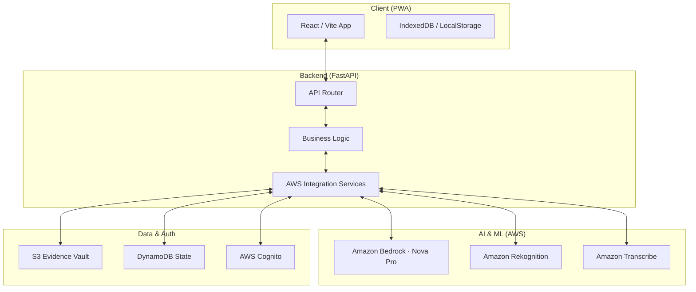

# Sewa Sahayak

> **🌐 Live Demo:** [http://43-205-103-222.nip.io](http://43-205-103-222.nip.io) *(hosted on AWS EC2, may have occasional downtime)*

Sewa Sahayak (सेवा सहायक) is a cutting-edge civic-tech platform that leverages **Amazon Bedrock's multi-modal AI** and **Amazon Nova Act's browser automation** to bridge the "Reporting Wall" between Indian citizens and government portals.

By transforming unstructured citizen evidence (dashcam footage, audio, and photos) into structured, data-rich official reports, the platform reduces reporting time from **15+ minutes to under 3 minutes**, significantly increasing civic participation in urban infrastructure maintenance.

---

## 🌟 Key Features

### 🎥 Dashcam AI Detection Pipeline
- Upload a dashcam video of any length — long videos are automatically split into 10-second segments via **FFmpeg**.
- Each segment is analysed by **Amazon Rekognition** (frame extraction) and **Amazon Bedrock (Nova Pro)** to detect potholes, their severity, and GPS coordinates.
- Per-user event store keeps detections private and isolated from other users' data.

### 🗺️ Interactive Pothole Map
- Detected potholes are **clustered by government portal and sub-area** on an interactive **Leaflet/React-Leaflet** map.
- Each cluster shows event count, worst severity, representative video clip, and the best extracted frames.
- One-click **"File Complaint"** marks a cluster as filed — the map pin is removed and a DynamoDB report is saved.

### 🔊 Voice Transcription (Regional Languages)
- Record or upload audio in any Indian language.
- Transcribed live via **Amazon Transcribe** with Indic language support.
- Transcript is used to pre-populate the report draft.

### 🛡️ Automatic PII Redaction
- Images uploaded as evidence are automatically scanned by **Amazon Rekognition**.
- Faces and license plates are blurred before storage in S3.
- Live camera preview also supports real-time coordinate-based blurring.

### 🔐 Dual OAuth Authentication
- **AWS Cognito** (email/phone) and **Google OAuth 2.0** sign-in flows.
- Session-based auth with per-user data segregation in **DynamoDB**.
- Contributor level / gamification: levels 1–5 based on report count.

### 📍 Intelligent Location Routing
- GPS-enabled: **Amazon Location Service** reverse-geocodes coordinates to a structured address.
- Manual mode: city + state + address string is verified and geocoded.
- **Bedrock (Nova Pro)** reads the routing knowledge base (`portals.json`) to determine the correct government portal for any address in India.

### 📶 Offline-First PWA
- **Progressive Web App** with service-worker support for offline evidence capture.
- Media saved to **IndexedDB** while offline, auto-synced to S3 + DynamoDB when connectivity is restored.
- Online/offline indicator displayed persistently on all pages.

### 👤 Profile Dashboard
- Shows total reports filed, unique areas mapped, contributor level, and member-since date.
- Report history pulled live from DynamoDB (newest first).

---

## 🛠️ Technology Stack

### Frontend
| Technology | Role |
|---|---|
| **React 19** + **Vite 7** | UI framework & build tool |
| **React Router v7** | Client-side routing |
| **Leaflet** + **React-Leaflet** | Interactive pothole map |
| **Lucide React** | Icon library |
| **vite-plugin-pwa** | PWA & service-worker generation |
| **IndexedDB (idb)** | Offline media queue |

### Backend
| Technology | Role |
|---|---|
| **FastAPI** | High-performance REST API |
| **Uvicorn** | ASGI server |
| **Authlib** | OAuth 2.0 (Cognito + Google) |
| **Starlette SessionMiddleware** | Cookie-based sessions |
| **OpenCV (headless)** | Video frame extraction |
| **NumPy + Pillow** | Image processing & PII blurring |
| **FFmpeg** | Long-video segmentation |
| **Boto3** | AWS SDK |

### AWS Services
| Service | Role |
|---|---|
| **Amazon Bedrock (Nova Pro)** | Multi-modal damage analysis + portal routing |
| **Amazon Rekognition** | Pothole frame detection + PII (face/plate) redaction |
| **Amazon Transcribe** | Indic-language audio transcription |
| **Amazon S3** | Evidence vault — images, audio, video clips |
| **Amazon DynamoDB** | Reports table + Users table |
| **AWS Cognito** | Hosted UI authentication |
| **Amazon Location Service** | Reverse geocoding + address verification |

---

## 🚀 Getting Started

### Prerequisites
- **Node.js 18+** & **npm**
- **Python 3.10+**
- **FFmpeg** installed and on `PATH`
- **AWS CLI** configured (`ap-south-1` region)
- Access to Bedrock (Nova Pro), Rekognition, Transcribe, Location Service

### 1. Clone the Repository
```bash
git clone https://github.com/Vedant-Baldwa/sewa_sahayak.git
cd sewa_sahayak
```

### 2. Frontend Setup
```bash
npm install
cp .env.example .env          # set VITE_BACKEND_URL
npm run dev
```
Frontend available at `http://localhost:5173`.

### 3. Backend Setup
```bash
cd backend
python -m venv venv
# Windows:
venv\Scripts\activate
# macOS/Linux:
source venv/bin/activate

pip install -r requirements.txt
cp .env.example .env          # fill in all AWS credentials/config (see table below)
python -m uvicorn main:app --reload --port 8000
```
API docs (Swagger) at `http://localhost:8000/docs`.

---

## 🔑 Environment Variables

### Frontend — `.env` (root)
| Variable | Description |
|---|---|
| `VITE_BACKEND_URL` | Base URL of the FastAPI backend (e.g. `http://localhost:8000` or your EC2 domain) |

### Backend — `backend/.env`
| Variable | Required | Description |
|---|---|---|
| `AWS_REGION` | ✅ | AWS region for all services (default: `ap-south-1`) |
| `AWS_ACCESS_KEY_ID` | ✅ (local dev) | IAM access key — use IAM roles in production |
| `AWS_SECRET_ACCESS_KEY` | ✅ (local dev) | IAM secret key — use IAM roles in production |
| `S3_BUCKET_NAME` | ✅ | S3 bucket for evidence storage |
| `DYNAMODB_TABLE` | ✅ | DynamoDB table for reports (default: `sewa_sahayak_reports`) |
| `USERS_TABLE_NAME` | ✅ | DynamoDB table for user profiles (default: `sewa_sahayak_users`) |
| `SECRET_KEY` | ✅ | Random secret (≥ 32 chars) for session cookie signing |
| `COGNITO_USER_POOL_ID` | ⚠️ | Cognito User Pool ID — omit to skip Cognito and use mock auth |
| `COGNITO_CLIENT_ID` | ⚠️ | Cognito App Client ID |
| `COGNITO_CLIENT_SECRET` | ⚠️ | Cognito App Client Secret |
| `GOOGLE_CLIENT_ID` | ⚠️ | Google OAuth 2.0 Client ID — omit to disable Google sign-in |
| `GOOGLE_CLIENT_SECRET` | ⚠️ | Google OAuth 2.0 Client Secret |
| `FRONTEND_URL` | ✅ | Full URL of the frontend (e.g. `http://localhost:5173`) |
| `BACKEND_URL` | ✅ | Full URL of the backend (e.g. `http://localhost:8000`) |

> ⚠️ means optional but required for that specific auth provider to work.

---

## 🏗️ Architecture



---

## 🚢 Deployment

The app is deployed on an **AWS EC2 instance** (Mumbai — `ap-south-1`) behind **Nginx**.

### Infrastructure
- **EC2** runs both the Nginx reverse proxy and the FastAPI backend (via PM2).
- **Nginx** serves the Vite `dist/` build as static files and proxies `/api/*`, `/login`, and `/authorize` to FastAPI on port `8000`.
- **PM2** keeps the FastAPI process alive and auto-restarts it on crash.
- The `sewa_sahayak.conf` file in the repo root is the active Nginx server block.

### CI/CD Pipeline (GitHub Actions)
Every push to `main` triggers `.github/workflows/deploy.yml`:

1. **Build** — `npm install && npm run build` produces `dist/`
2. **Rsync** — uploads the full repo (excluding `.git`, `node_modules`, `venv`) to `/var/www/sewa_sahayak/` over SSH
3. **Backend restart** — SSH into EC2, activate venv, `pip install`, restart PM2 process `sewa_backend`
4. **Nginx restart** — `sudo systemctl restart nginx`

> Secrets required in GitHub repository settings: `EC2_SSH_KEY`, `EC2_HOST`, `EC2_USER`.

---

## 🤝 Contributing

Contributions are welcome! To get started:

1. **Fork** the repository and create a feature branch (`git checkout -b feat/your-feature`).
2. Make your changes and ensure the frontend (`npm run lint`) and backend (`python run_tests.py`) pass.
3. **Commit** with a clear message and open a **Pull Request** against `main`.
4. A maintainer will review and merge.

Please keep PRs focused — one feature or fix per PR makes review faster.

---

## 📜 License

This project is licensed under the **Apache 2.0 License**. See the [LICENSE](LICENSE) file for details.
