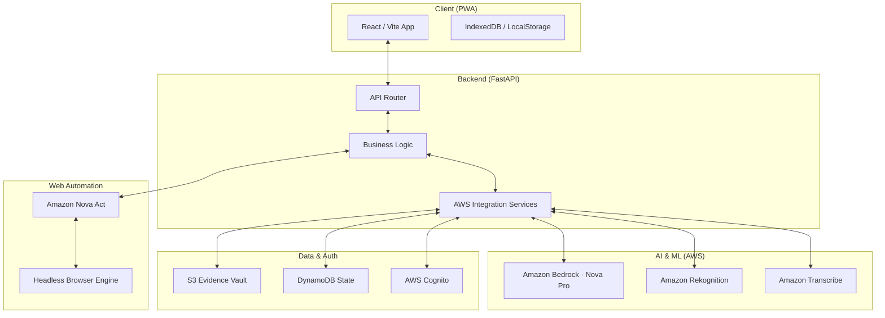

# Sewa Sahayak

Sewa Sahayak (सेवा सहायक) is a cutting-edge civic-tech platform that leverages **Amazon Bedrock's multi-modal AI** and **Amazon Nova Act's browser automation** to bridge the "Reporting Wall" between Indian citizens and government portals.

By transforming unstructured citizen evidence (voice, video, and photos) into structured, data-rich official reports, the platform reduces the reporting time from 15+ minutes to under 3 minutes, significantly increasing civic participation in urban infrastructure maintenance.

---

## 🌟 Key Features

- **Multi-Modal Evidence Capture**: Seamlessly upload audio descriptions (in regional languages), videos of road damage, and high-resolution photos.
- **Sahayak AI Chatbot**: An intelligent, multi-lingual assistant (powered by Nova Pro) that helps users navigate the platform and understand civic reporting in 10+ Indian languages.
- **Intelligent Language Detection**: Automatic language switching based on GPS coordinates and browser locale, with support for regional dialects.
- **Agentic Form Filling**: Uses **Amazon Nova Act** to automatically navigate complex government portals (like CPGRAMS, NHAI, or MCD), handling data entry and interactive CAPTCHA challenges.
- **Enhanced Report History**: A robust dashboard to track past submissions, featuring media previews and structured status updates.
- **Privacy First**: Integrated PII redaction using **Amazon Rekognition** to blur faces and license plates before any data is stored or submitted.

---

## 🛠️ Technology Stack

### Frontend
- **React 19** with **Vite** for a high-performance, responsive UI.
- **Progressive Web App (PWA)** support for offline-first capabilities and mobile-app-like experience.
- **Lucide React** for modern, accessible iconography.

### Backend
- **FastAPI (Python)** for a modular, high-performance API layer.
- **Boto3** for deep integration with AWS ecosystem.
- **Uvicorn** as the lightning-fast ASGI server.

### AI & AWS Services
- **Amazon Bedrock (Nova Pro)**: Multi-modal analysis and conversational AI.
- **Amazon Nova Act**: Intelligent browser automation for portal interaction.
- **Amazon Rekognition**: Computer vision for damage analysis and privacy redaction.
- **Amazon Transcribe**: High-accuracy transcription for Indic languages.
- **Amazon S3**: Secure object storage for evidence vaulting.
- **Amazon DynamoDB**: Scalable NoSQL database for session and report persistence.
- **AWS Cognito**: Secure OAuth 2.0 based user authentication.

---

## 🚀 Getting Started

### Prerequisites

- **Node.js 18+** & **npm**
- **Python 3.10+**
- **AWS CLI** configured with appropriate permissions in `ap-south-1` (Mumbai).
- Access to **Amazon Bedrock** (Nova Pro), **Nova Act**, and **Rekognition** in your AWS account.

### 1. Clone the Repository
```bash
git clone https://github.com/Vedant-Baldwa/sewa_sahayak.git
cd sewa_sahayak
```

### 2. Frontend Setup
```bash
# Install dependencies
npm install

# Setup environment variables
cp .env.example .env

# Run development server
npm run dev
```
The frontend will be available at `http://localhost:5173`.

### 3. Backend Setup
```bash
cd backend
# Create and activate virtual environment (optional but recommended)
python -m venv venv
source venv/bin/activate  # On Windows: venv\Scripts\activate

# Install dependencies
pip install -r requirements.txt

# Setup backend environment variables
cp .env.example .env

# Run the API server
python -m uvicorn main:app --reload --port 8000
```
The API documentation (Swagger) will be available at `http://localhost:8000/docs`.

---

## 🏗️ Project Architecture



---

## 📂 Project Structure

```
sewa_sahayak/
├── backend/            # FastAPI Python server
│   ├── api/            # API routes (Auth, Reports, AI, Agentic)
│   ├── core/           # Configuration and shared utilities
│   ├── services/       # AWS client wrappers and business logic
│   └── main.py         # Application entry point
├── src/                # Frontend React code
│   ├── components/     # Reusable UI elements
│   ├── pages/          # Full page views (Report, History, etc.)
│   ├── hooks/          # Custom React hooks for API interaction
│   └── store/          # State management logic
├── public/             # Static assets
└── .env.example        # Environment variable template
```

---

## 🧪 Testing

```bash
# Frontend Tests
npm test

# Backend Tests
cd backend
python run_tests.py
```

---

## 📜 License

This project is licensed under the **Apache 2.0 License**. See the [LICENSE](LICENSE) file for details.

