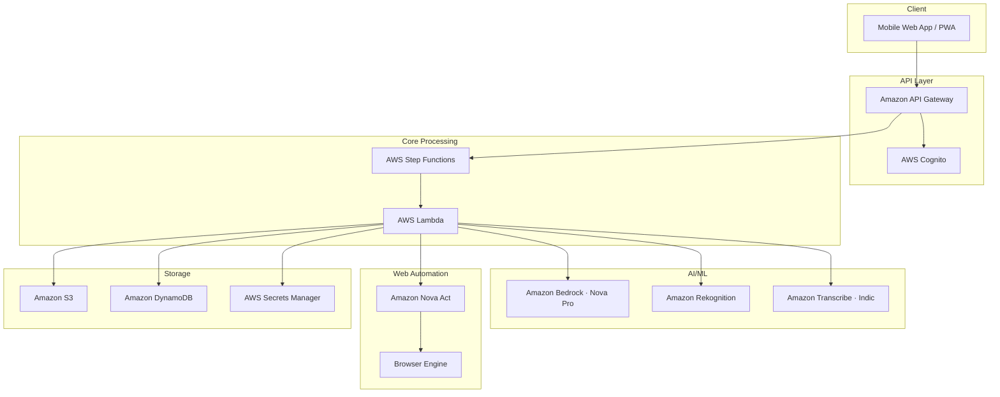

# Sewa Sahayak

Sewa Sahayak is a civic-tech solution that leverages Amazon Bedrock's multi-modal AI capabilities to automate road damage reporting to Indian government portals. The system addresses the "Reporting Wall" problem by acting as an intelligent intermediary that processes citizen-submitted evidence (video/voice) and automatically fills government forms using agentic web automation.

By reducing reporting time from 15+ minutes to under 3 minutes, the system aims to increase civic participation in infrastructure maintenance.

---

## Getting Started

### Prerequisites

- Node.js 18+
- AWS CLI configured with appropriate permissions
- Access to Amazon Bedrock, Nova Act, Rekognition, and Transcribe in `ap-south-1`

### Installation

```bash
git clone https://github.com/Vedant-Baldwa/sewa_sahayak.git
cd sewa_sahayak
npm install
```

### Environment Variables

```bash
cp .env.example .env
```

| Variable | Description |
|----------|-------------|
| `AWS_REGION` | Target AWS region (default: `ap-south-1`) |
| `BEDROCK_MODEL_ID` | Bedrock model ARN for Nova Pro |
| `COGNITO_USER_POOL_ID` | Cognito user pool ID |
| `S3_EVIDENCE_BUCKET` | S3 bucket for evidence storage |
| `DYNAMODB_TABLE` | DynamoDB table for session state |

### Running Locally

```bash
npm run dev
```

Starts the development server at `http://localhost:3000`. Ensure all AWS sandbox credentials in `.env` are populated before starting backend services.

---

## Architecture & Technology Stack

The system combines **Amazon Bedrock LLMs** for multi-modal analysis with **Amazon Nova Act** for browser automation, creating a seamless bridge between citizens and government reporting systems.

It follows a microservices architecture leveraging AWS:

- **Frontend**: Mobile Web App / Progressive Web App (PWA)
- **API & Auth**: Amazon API Gateway, AWS Cognito
- **Core Processing**: AWS Step Functions, AWS Lambda Functions
- **AI/ML Services**: Amazon Bedrock (Nova Pro), Amazon Rekognition, Amazon Transcribe (Indic)
- **Web Automation**: Amazon Nova Act & Browser Automation Engine
- **Storage**: Amazon S3, Amazon DynamoDB, AWS Secrets Manager



---

## Key Components

1. **Evidence Capture Module**: Processes video, voice, and location data from user submissions, extracting GPS coordinates and converting formats. Features support for offline storage and synchronization logic.

2. **Bedrock Analysis Agent**: Responsible for vision analysis to gauge infrastructure damage (e.g., potholes, cracks), voice transcription spanning regional Indian languages, and comprehensive severity assessments.

3. **Portal Router**: Determines the appropriate government jurisdiction (municipal, state, or central) and selects the relevant portal based on location and historical effectiveness tracking.

4. **Web Bridge Agent**: Uses visual form field detection to interact with government websites and automate data entry, while handling session management and CAPTCHA detection.

5. **Privacy Engine**: Applies PII redaction rules utilizing Amazon Rekognition to anonymize human faces, license plates, and sensitive audio before storage or submission.

6. **Human Loop Interface**: Ensures reporting safety by providing users an opportunity to verify generated official reports prior to automated submission — specifically on 90%+ completion or CAPTCHA encounters.

---

## Data Flow Pipeline

1. **Submission**: User uploads photos/videos/audio via the lightweight PWA.
2. **Analysis**: AI identifies the exact damage type and severity, transcribes regional dialects, and establishes location context.
3. **Privacy Scrubbing**: Videos and photos are scanned for faces/license plates and instantly blurred.
4. **Drafting**: The Web Bridge generates a detailed official report combining AI descriptions, metadata, and GPS markers.
5. **Automation**: Nova Act assumes control of a headless browser to map the generated draft payloads into corresponding municipal reporting endpoints.

---

## Project Structure

```
sewa_sahayak/
├── src/
│   ├── capture/          # Evidence ingestion and preprocessing
│   ├── analysis/         # Bedrock and Rekognition integration
│   ├── routing/          # Jurisdiction and portal selection logic
│   ├── automation/       # Nova Act browser automation
│   ├── privacy/          # PII redaction pipeline
│   └── human-loop/       # CAPTCHA handoff and draft review
├── infra/                # AWS CDK / SAM deployment configs
├── tests/
│   ├── unit/
│   └── property/         # fast-check property-based tests
└── .env.example
```

---

## Testing

```bash
# Unit tests
npm test

# Property-based tests (fast-check, 100 iterations per property)
npm run test:property

# Integration tests
npm run test:integration
```

The platform's correctness is enforced through property-based testing via **fast-check** and Jest, covering:

- Jurisdiction accuracy across municipal, state, and central tiers
- Fail-safe error recovery for form validation blocks and session timeouts
- Regional language transcription across Hindi, Tamil, Telugu, Bengali, Marathi, Gujarati, Kannada, Malayalam, Punjabi, and Odia

---

## Contributing

1. Fork the repository
2. Create a feature branch (`git checkout -b feature/your-feature`)
3. Commit your changes (`git commit -m 'feat: your feature'`)
4. Push to the branch (`git push origin feature/your-feature`)
5. Open a Pull Request

Please ensure all property tests pass before submitting a PR.

---

## License

This project is licensed under the [Apache 2.0](LICENSE)
