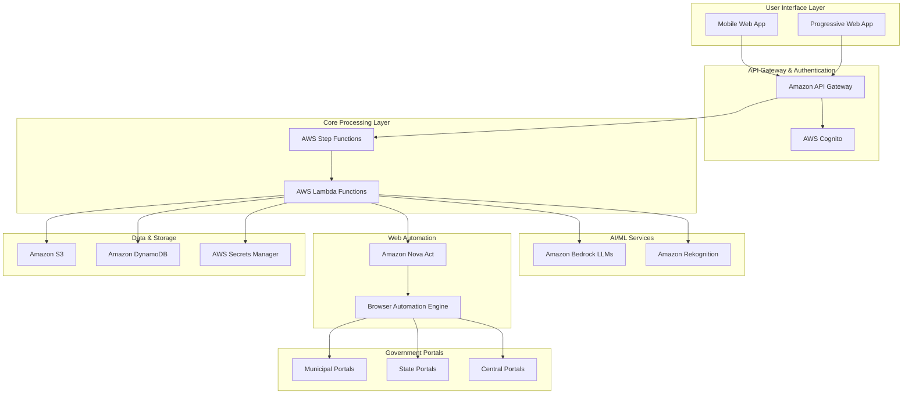

# Design Document: Seva Sahayak

## Overview

Seva Sahayak is a civic-tech solution that leverages Amazon Bedrock's multi-modal AI capabilities to automate road damage reporting to Indian government portals. The system addresses the "Reporting Wall" problem by acting as an intelligent intermediary that processes citizen-submitted evidence (video/voice) and automatically fills government forms using agentic web automation.

The system combines Amazon Bedrock LLMs for multi-modal analysis with Amazon Nova Act for browser automation, creating a seamless bridge between citizens and government reporting systems. By reducing reporting time from 15+ minutes to under 3 minutes, the system aims to increase civic participation in infrastructure maintenance.

## Architecture

### High-Level Architecture



### Component Architecture

The system follows a microservices architecture with the following key components:

1. **Evidence Capture Module**: Handles multi-modal input processing
2. **Bedrock Analysis Agent**: Performs AI analysis using Bedrock LLMs
3. **Portal Router**: Determines appropriate government portal
4. **Web Bridge Agent**: Automates form filling using Nova Act
5. **Privacy Engine**: Handles PII redaction and data protection
6. **Human Loop Interface**: Manages user verification and control

## Components and Interfaces

### Evidence Capture Module

**Purpose**: Processes video, voice, and location data from user submissions.

**Key Functions**:
- Video upload and preprocessing
- GPS coordinate extraction
- Metadata collection (timestamp, device info)
- Input validation and format conversion

**Interfaces**:
```typescript
interface EvidenceInput {
  videoFile?: File;
  audioFile?: File;
  gpsCoordinates?: {
    latitude: number;
    longitude: number;
    accuracy: number;
  };
  timestamp: Date;
  deviceInfo: DeviceMetadata;
}

interface ProcessedEvidence {
  evidenceId: string;
  s3VideoPath?: string;
  s3AudioPath?: string;
  location: LocationData;
  metadata: EvidenceMetadata;
}
```

### Bedrock Analysis Agent

**Purpose**: Multi-modal AI analysis using Amazon Bedrock LLMs for damage assessment and language processing.

**Key Functions**:
- Video analysis for damage detection and classification using Claude or other vision-capable LLMs
- Voice transcription and content extraction in regional languages
- Severity assessment and damage categorization
- Location context analysis

**Interfaces**:
```typescript
interface AnalysisRequest {
  evidenceId: string;
  videoPath?: string;
  audioPath?: string;
  location: LocationData;
}

interface AnalysisResult {
  damageType: 'pothole' | 'crack' | 'surface_deterioration' | 'multiple';
  severity: 'low' | 'medium' | 'high' | 'critical';
  description: string;
  confidence: number;
  extractedText?: string;
  detectedLanguage?: string;
  visualFeatures: DamageFeature[];
}
```

### Portal Router

**Purpose**: Determines the appropriate government portal based on location and damage type.

**Key Functions**:
- Jurisdiction mapping (municipal/state/central)
- Portal selection based on damage type
- Historical effectiveness tracking
- Fallback portal identification

**Interfaces**:
```typescript
interface PortalRoutingRequest {
  location: LocationData;
  damageType: string;
  severity: string;
}

interface SelectedPortal {
  portalId: string;
  portalName: string;
  jurisdiction: 'municipal' | 'state' | 'central';
  baseUrl: string;
  formPath: string;
  expectedResponseTime: number;
  confidence: number;
}
```

### Web Bridge Agent

**Purpose**: Automates form filling on government websites using Amazon Nova Act for browser automation.

**Key Functions**:
- Visual form field detection and interaction
- Automated data entry using Nova Act's browser automation capabilities
- Session management and error handling
- CAPTCHA detection and user handoff

**Interfaces**:
```typescript
interface FormFillingRequest {
  portal: SelectedPortal;
  reportData: ReportData;
  evidenceUrls: string[];
}

interface FormFillingResult {
  status: 'completed' | 'requires_human' | 'failed';
  filledFields: FieldMapping[];
  pendingActions: PendingAction[];
  sessionUrl?: string;
  errorDetails?: string;
}
```

### Privacy Engine

**Purpose**: Handles PII redaction and privacy compliance using Amazon Rekognition.

**Key Functions**:
- Face detection and blurring
- License plate redaction
- Audio PII removal
- Data encryption and secure storage

**Interfaces**:
```typescript
interface PrivacyProcessingRequest {
  videoPath?: string;
  audioPath?: string;
  processingOptions: PrivacyOptions;
}

interface PrivacyProcessingResult {
  processedVideoPath?: string;
  processedAudioPath?: string;
  redactionLog: RedactionEvent[];
  complianceStatus: 'compliant' | 'requires_review';
}
```

## Data Models

### Core Data Models

```typescript
// User and Session Management
interface User {
  userId: string;
  phoneNumber: string;
  preferredLanguage: string;
  location?: LocationData;
  createdAt: Date;
  lastActive: Date;
}

interface ReportSession {
  sessionId: string;
  userId: string;
  status: 'capturing' | 'processing' | 'reviewing' | 'submitting' | 'completed' | 'failed';
  evidenceId?: string;
  analysisResult?: AnalysisResult;
  selectedPortal?: SelectedPortal;
  formFillingResult?: FormFillingResult;
  createdAt: Date;
  updatedAt: Date;
}

// Location and Geographic Data
interface LocationData {
  latitude: number;
  longitude: number;
  accuracy: number;
  address?: string;
  city: string;
  state: string;
  pincode: string;
  ward?: string;
  constituency?: string;
}

// Damage Analysis
interface DamageFeature {
  type: string;
  boundingBox: BoundingBox;
  confidence: number;
  severity: string;
  description: string;
}

interface BoundingBox {
  left: number;
  top: number;
  width: number;
  height: number;
}

// Government Portal Configuration
interface GovernmentPortal {
  portalId: string;
  name: string;
  jurisdiction: 'municipal' | 'state' | 'central';
  baseUrl: string;
  formSelectors: FormSelector[];
  supportedDamageTypes: string[];
  geographicCoverage: GeographicArea[];
  apiEndpoint?: string;
  lastUpdated: Date;
  isActive: boolean;
}

interface FormSelector {
  fieldName: string;
  selector: string;
  inputType: 'text' | 'select' | 'file' | 'textarea';
  required: boolean;
  validationRules?: ValidationRule[];
}

// Report Data Structure
interface ReportData {
  reportId: string;
  damageType: string;
  severity: string;
  description: string;
  location: LocationData;
  reporterInfo: ReporterInfo;
  evidenceUrls: string[];
  submissionTimestamp: Date;
  governmentReferenceId?: string;
}

interface ReporterInfo {
  name?: string;
  phoneNumber: string;
  email?: string;
  isAnonymous: boolean;
}
```

### Database Schema (DynamoDB)

```typescript
// Primary Tables
interface UsersTable {
  PK: string; // USER#{userId}
  SK: string; // PROFILE
  userId: string;
  phoneNumber: string;
  preferredLanguage: string;
  location?: LocationData;
  createdAt: string;
  lastActive: string;
  GSI1PK?: string; // PHONE#{phoneNumber}
}

interface ReportSessionsTable {
  PK: string; // SESSION#{sessionId}
  SK: string; // METADATA
  sessionId: string;
  userId: string;
  status: string;
  evidenceId?: string;
  analysisResult?: AnalysisResult;
  selectedPortal?: SelectedPortal;
  formFillingResult?: FormFillingResult;
  createdAt: string;
  updatedAt: string;
  GSI1PK?: string; // USER#{userId}
  GSI1SK?: string; // SESSION#{createdAt}
}

interface GovernmentPortalsTable {
  PK: string; // PORTAL#{portalId}
  SK: string; // CONFIG
  portalId: string;
  name: string;
  jurisdiction: string;
  baseUrl: string;
  formSelectors: FormSelector[];
  supportedDamageTypes: string[];
  geographicCoverage: GeographicArea[];
  lastUpdated: string;
  isActive: boolean;
  GSI1PK?: string; // JURISDICTION#{jurisdiction}
}

interface ReportsTable {
  PK: string; // REPORT#{reportId}
  SK: string; // METADATA
  reportId: string;
  sessionId: string;
  userId: string;
  damageType: string;
  severity: string;
  location: LocationData;
  status: 'submitted' | 'acknowledged' | 'in_progress' | 'resolved';
  governmentReferenceId?: string;
  submissionTimestamp: string;
  GSI1PK?: string; // LOCATION#{state}#{city}
  GSI1SK?: string; // DAMAGE#{damageType}#{submissionTimestamp}
}
```

Now I need to use the prework tool to analyze the acceptance criteria before writing the Correctness Properties section.

<function_calls>
<invoke name="prework">
<parameter name="featureName">roadfix-ai

## Correctness Properties

*A property is a characteristic or behavior that should hold true across all valid executions of a system—essentially, a formal statement about what the system should do. Properties serve as the bridge between human-readable specifications and machine-verifiable correctness guarantees.*

Based on the prework analysis of acceptance criteria, the following properties ensure the correctness of Seva Sahayak across all valid inputs and scenarios:

### Property 1: Multi-modal Evidence Processing
*For any* combination of video and voice input with location data, the Evidence Capture Module and Bedrock Analysis Agent should successfully extract GPS coordinates, timestamp, damage assessment, and relevant details from voice content, producing a complete evidence record.
**Validates: Requirements 1.1, 1.2, 1.3**

### Property 2: Jurisdiction Mapping Accuracy
*For any* valid location data provided to the Portal Router, the system should correctly identify the appropriate government jurisdiction (municipal, state, or central) and select a portal that serves that geographic area.
**Validates: Requirements 2.1, 2.2**

### Property 3: Portal Selection with Prioritization
*For any* damage type and location where multiple government portals are applicable, the Portal Router should select the portal with the best historical response time and effectiveness metrics, and provide complete portal information including expected response timeline.
**Validates: Requirements 2.3, 2.4**

### Property 4: Form Field Detection and Population
*For any* government portal accessed by the Web Bridge Agent, the system should visually identify form fields, populate them with appropriate data from the evidence analysis, and handle various form elements (text fields, dropdowns, file uploads) correctly.
**Validates: Requirements 3.1, 3.2, 3.3**

### Property 5: Form Submission Error Recovery
*For any* form validation error or session timeout encountered during form filling, the Web Bridge Agent should detect the issue, correct the entries where possible, and retry submission while maintaining session state.
**Validates: Requirements 3.4, 3.5**

### Property 6: PII Detection and Redaction
*For any* video or audio content processed by the Privacy Engine, the system should automatically detect and redact human faces, license plates, and personal information in audio, while preserving the essential damage-related content.
**Validates: Requirements 4.1, 4.2, 4.3**

### Property 7: Data Encryption and Privacy Compliance
*For any* processed media or user data stored by the system, the Privacy Engine should apply industry-standard encryption (AES-256 for rest, TLS 1.3 for transit) and flag uncertain PII detection cases for human review.
**Validates: Requirements 4.4, 4.5**

### Property 8: Human-in-the-Loop Handoff
*For any* form filling session that reaches 90% completion or encounters CAPTCHA/human verification, the Human Loop Interface should present the form for user review, highlight auto-filled fields, and enable user modifications before final submission.
**Validates: Requirements 5.1, 5.2, 5.3, 5.4, 5.5**

### Property 9: Multi-language Processing
*For any* voice input in supported Indian regional languages (Hindi, Tamil, Telugu, Bengali, Marathi, Gujarati, Kannada, Malayalam, Punjabi, Odia), the Bedrock Analysis Agent should automatically detect the language, transcribe the content accurately including dialects and accents, and maintain semantic accuracy in translations.
**Validates: Requirements 6.1, 6.2, 6.3, 6.5**

### Property 10: Offline Storage and Synchronization
*For any* evidence capture session when internet connectivity is unavailable, the Evidence Capture Module should store video and voice data locally, then automatically sync to cloud processing when connectivity is restored, with proper storage management and user status indication.
**Validates: Requirements 7.1, 7.2, 7.4, 7.5**

### Property 11: Performance Requirements Compliance
*For any* processing operation (video analysis under 100MB, voice transcription under 2 minutes, form filling), the system should complete within specified time limits (30s, 15s, 60s respectively) and provide progress updates every 10 seconds for longer operations.
**Validates: Requirements 8.1, 8.2, 8.3, 8.4**

### Property 12: Cross-Platform Compatibility
*For any* supported video format and resolution (up to 4K), the system should process the content correctly across different mobile browsers and screen sizes (4-7 inches), with responsive design and appropriate compression options for limited storage.
**Validates: Requirements 9.3, 9.4, 9.5**

### Property 13: Data Security and User Control
*For any* user data collection, storage, or sharing operation, the system should obtain explicit consent, use proper encryption, enable data deletion within 30 days upon request, and log all data transfers with user notification.
**Validates: Requirements 10.3, 10.4, 10.5**

### Property 14: Damage Classification Consistency
*For any* road damage analysis, the Bedrock Analysis Agent should identify damage types using consistent criteria, categorize severity levels uniformly, detect multiple damage types when present, and flag uncertain assessments for human review while handling various environmental conditions.
**Validates: Requirements 11.1, 11.2, 11.3, 11.4, 11.5**

### Property 15: System Monitoring and Analytics
*For any* user interaction, system error, or report submission, the system should generate appropriate logs with sufficient detail for debugging, track submission outcomes, generate capacity alerts based on usage patterns, and provide privacy-compliant aggregated analytics.
**Validates: Requirements 12.1, 12.2, 12.3, 12.4, 12.5**

## Error Handling

### Error Categories and Strategies

**1. Input Validation Errors**
- Invalid video formats or corrupted files
- Missing GPS data or invalid coordinates
- Audio quality too poor for transcription
- Strategy: Graceful degradation with user feedback and alternative input options

**2. AI Processing Errors**
- Bedrock Analysis Agent failures or timeouts
- Low confidence in damage classification
- Language detection failures
- Strategy: Retry with exponential backoff, fallback to human review, error logging

**3. Web Automation Errors**
- Government portal unavailability or changes
- Form field detection failures
- Session timeouts or CAPTCHA challenges
- Strategy: Portal fallback selection, human-in-the-loop handoff, session recovery

**4. Privacy and Security Errors**
- PII detection failures
- Encryption key issues
- Data compliance violations
- Strategy: Fail-safe to human review, secure error logging, compliance alerts

**5. Infrastructure Errors**
- AWS service outages
- Network connectivity issues
- Storage capacity limits
- Strategy: Circuit breaker patterns, offline mode, graceful degradation

### Error Recovery Mechanisms

```typescript
interface ErrorRecoveryStrategy {
  errorType: string;
  maxRetries: number;
  backoffStrategy: 'exponential' | 'linear' | 'immediate';
  fallbackAction: 'human_review' | 'alternative_portal' | 'offline_mode' | 'user_notification';
  escalationThreshold: number;
}

// Example error recovery configurations
const errorStrategies: ErrorRecoveryStrategy[] = [
  {
    errorType: 'bedrock_analysis_timeout',
    maxRetries: 3,
    backoffStrategy: 'exponential',
    fallbackAction: 'human_review',
    escalationThreshold: 5
  },
  {
    errorType: 'portal_form_detection_failure',
    maxRetries: 2,
    backoffStrategy: 'immediate',
    fallbackAction: 'alternative_portal',
    escalationThreshold: 3
  },
  {
    errorType: 'network_connectivity_loss',
    maxRetries: 0,
    backoffStrategy: 'immediate',
    fallbackAction: 'offline_mode',
    escalationThreshold: 1
  }
];
```

## Testing Strategy

### Dual Testing Approach

The testing strategy employs both unit testing and property-based testing to ensure comprehensive coverage:

**Unit Tests**: Focus on specific examples, edge cases, and integration points between components. These tests validate concrete scenarios and catch specific bugs in implementation details.

**Property Tests**: Verify universal properties across all inputs using randomized test data. These tests ensure the system behaves correctly across the full input space and catch edge cases that might be missed by example-based tests.

Together, unit tests and property tests provide complementary coverage—unit tests catch concrete implementation bugs while property tests verify general correctness guarantees.

### Property-Based Testing Configuration

**Testing Framework**: Use **fast-check** for TypeScript/JavaScript property-based testing, integrated with Jest for the overall testing framework.

**Test Configuration**:
- Minimum 100 iterations per property test (due to randomization)
- Each property test references its corresponding design document property
- Tag format: **Feature: seva-sahayak, Property {number}: {property_text}**

**Property Test Implementation Requirements**:
- Each correctness property must be implemented by a single property-based test
- Tests should generate realistic input data (valid video files, location coordinates, damage types)
- Use appropriate generators for Indian geographic data, regional languages, and government portal structures
- Include edge case generators for poor quality media, network failures, and unusual input combinations

### Unit Testing Focus Areas

**Specific Examples and Edge Cases**:
- GPS unavailable scenarios (Requirement 1.4)
- CAPTCHA encounters during form filling (Requirement 5.3)
- Platform compatibility on specific Android/iOS versions (Requirements 9.1, 9.2)
- Explicit consent collection flows (Requirement 10.2)

**Integration Testing**:
- End-to-end report submission workflows
- Cross-component data flow validation
- AWS service integration points
- Government portal interaction scenarios

**Error Condition Testing**:
- Network failure scenarios
- Invalid input handling
- Service timeout behaviors
- Data corruption recovery

### Test Data Management

**Synthetic Data Generation**:
- Generate realistic Indian addresses and coordinates
- Create sample road damage videos with known characteristics
- Produce multi-language voice samples for testing
- Mock government portal responses and form structures

**Privacy-Compliant Testing**:
- Use synthetic PII data for privacy testing
- Ensure no real user data in test environments
- Validate PII redaction with known test cases
- Test encryption/decryption with controlled keys

### Continuous Testing Strategy

**Automated Testing Pipeline**:
- Property tests run on every commit with full 100-iteration cycles
- Unit tests provide fast feedback in development
- Integration tests run on staging environment deployments
- Performance tests validate timing requirements

**Monitoring and Alerting**:
- Property test failures trigger immediate alerts
- Performance regression detection for timing requirements
- Government portal availability monitoring
- AI model accuracy tracking over time