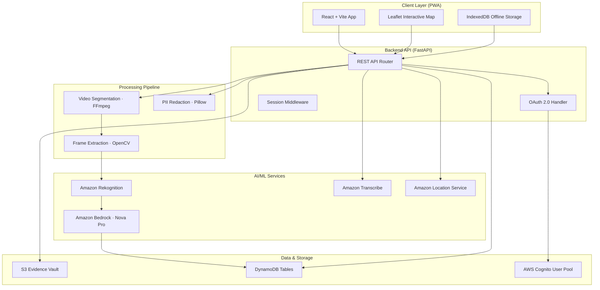

# Design Document: Sewa Sahayak

## Overview

Sewa Sahayak is a civic-tech solution that leverages Amazon Bedrock's multi-modal AI capabilities to streamline road damage reporting to Indian government portals. The system addresses the "Reporting Wall" problem by processing citizen-submitted evidence (dashcam video, voice, photos) and generating structured, data-rich report drafts that users can review and submit.

The system combines Amazon Bedrock (Nova Pro) for multi-modal analysis, Amazon Rekognition for visual detection and PII redaction, and Amazon Transcribe for voice processing. By reducing reporting time from 15+ minutes to under 3 minutes and providing an interactive map-based interface, the system aims to increase civic participation in infrastructure maintenance.

## Architecture

### High-Level Architecture


```mermaid
graph TB
    subgraph "Client Layer (PWA)"
        UI[React + Vite App]
        MAP[Leaflet Interactive Map]
        OFFLINE[IndexedDB Offline Storage]
    end
    
    subgraph "Backend API (FastAPI)"
        API[REST API Router]
        AUTH[OAuth 2.0 Handler]
        SESSION[Session Middleware]
    end
    
    subgraph "AI/ML Services"
        BEDROCK[Amazon Bedrock · Nova Pro]
        REKOGNITION[Amazon Rekognition]
        TRANSCRIBE[Amazon Transcribe]
        LOCATION[Amazon Location Service]
    end
    
    subgraph "Data & Storage"
        S3[S3 Evidence Vault]
        DYNAMO[DynamoDB Tables]
        COGNITO[AWS Cognito User Pool]
    end
    
    subgraph "Processing Pipeline"
        VIDEO[Video Segmentation · FFmpeg]
        FRAME[Frame Extraction · OpenCV]
        PII[PII Redaction · Pillow]
    end
    
    UI --> API
    MAP --> API
    OFFLINE --> API
    API --> AUTH
    AUTH --> COGNITO
    API --> VIDEO
    VIDEO --> FRAME
    FRAME --> REKOGNITION
    REKOGNITION --> BEDROCK
    API --> TRANSCRIBE
    API --> LOCATION
    API --> PII
    BEDROCK --> DYNAMO
    API --> S3
    API --> DYNAMO
```

### Component Architecture

The system follows a layered architecture with the following key components:

1. **Dashcam Detection Pipeline**: Processes video uploads with FFmpeg segmentation and Rekognition analysis
2. **Bedrock Analysis Engine**: Multi-modal AI analysis for damage assessment and portal routing
3. **Interactive Map Module**: Leaflet-based clustering and visualization of detected potholes
4. **Voice Transcription Service**: Regional language support via Amazon Transcribe
5. **Privacy Engine**: PII redaction using Rekognition and image processing
6. **Location Intelligence**: GPS and address handling via Amazon Location Service
7. **Offline-First Storage**: IndexedDB-based queue for evidence capture without connectivity

## Components and Interfaces

### Dashcam Detection Pipeline

**Purpose**: Processes uploaded dashcam videos of any length, segments them, and detects potholes with location data.

**Key Functions**:
- Video upload and validation
- FFmpeg-based segmentation into 10-second clips
- Frame extraction via OpenCV
- Rekognition-based pothole detection
- GPS coordinate extraction and association
- Per-user event storage in DynamoDB

**Interfaces**:
```typescript
interface VideoUploadRequest {
  videoFile: File;
  userId: string;
  uploadTimestamp: Date;
}

interface VideoSegment {
  segmentId: string;
  s3Path: string;
  startTime: number;
  duration: number;
  gpsCoordinates?: {
    latitude: number;
    longitude: number;
  };
}

interface DetectionEvent {
  eventId: string;
  userId: string;
  segmentId: string;
  damageType: 'pothole' | 'crack' | 'surface_deterioration';
  severity: 'low' | 'medium' | 'high' | 'critical';
  confidence: number;
  location: LocationData;
  frameS3Path: string;
  videoClipS3Path: string;
  timestamp: Date;
}
```

### Bedrock Analysis Engine

**Purpose**: Multi-modal AI analysis using Amazon Bedrock Nova Pro for damage assessment, severity classification, and portal routing.

**Key Functions**:
- Frame-by-frame damage analysis using Nova Pro vision capabilities
- Severity assessment based on visual features
- Portal routing using knowledge base (portals.json)
- Location context analysis for jurisdiction determination
- Report draft generation

**Interfaces**:
```typescript
interface BedrockAnalysisRequest {
  frameS3Paths: string[];
  location: LocationData;
  audioTranscript?: string;
}

interface BedrockAnalysisResult {
  damageType: 'pothole' | 'crack' | 'surface_deterioration' | 'multiple';
  severity: 'low' | 'medium' | 'high' | 'critical';
  description: string;
  confidence: number;
  visualFeatures: DamageFeature[];
  recommendedPortal: PortalInfo;
  draftReport: string;
}

interface PortalInfo {
  portalName: string;
  jurisdiction: 'municipal' | 'state' | 'central';
  baseUrl: string;
  routingReason: string;
}
```

### Interactive Map Module

**Purpose**: Visualizes detected potholes on an interactive map with clustering by portal and sub-area.

**Key Functions**:
- Leaflet/React-Leaflet map rendering
- Geographic clustering of detection events
- Cluster metadata aggregation (count, worst severity, representative clip)
- One-click complaint filing workflow
- Map pin removal and report persistence

**Interfaces**:
```typescript
interface MapCluster {
  clusterId: string;
  portalName: string;
  subArea: string;
  centerCoordinates: {
    latitude: number;
    longitude: number;
  };
  eventCount: number;
  worstSeverity: 'low' | 'medium' | 'high' | 'critical';
  representativeVideoUrl: string;
  bestFrameUrls: string[];
  events: DetectionEvent[];
}

interface ComplaintFilingRequest {
  clusterId: string;
  userId: string;
  selectedEvents: string[];
  additionalNotes?: string;
}

interface FiledComplaint {
  complaintId: string;
  clusterId: string;
  userId: string;
  portalName: string;
  filedAt: Date;
  status: 'filed' | 'acknowledged' | 'in_progress' | 'resolved';
}
```

### Voice Transcription Service

**Purpose**: Transcribes audio recordings in Indian regional languages using Amazon Transcribe.

**Key Functions**:
- Audio upload and format validation
- Real-time transcription via Transcribe streaming API
- Automatic language detection for Indic languages
- Transcript integration into report drafts

**Interfaces**:
```typescript
interface TranscriptionRequest {
  audioFile: File;
  userId: string;
  preferredLanguage?: string;
}

interface TranscriptionResult {
  transcriptId: string;
  detectedLanguage: string;
  transcript: string;
  confidence: number;
  audioS3Path: string;
  duration: number;
}

interface SupportedLanguage {
  code: string;
  name: string;
  transcribeCode: string;
}

// Supported: Hindi, Tamil, Telugu, Bengali, Marathi, Gujarati, Kannada, Malayalam, Punjabi, Odia
```

### Privacy Engine

**Purpose**: Handles PII redaction and privacy compliance using Amazon Rekognition and image processing.

**Key Functions**:
- Face detection and blurring via Rekognition
- License plate detection and redaction
- Real-time coordinate-based blurring for live camera preview
- Secure storage with encryption (S3 server-side encryption)

**Interfaces**:
```typescript
interface PIIRedactionRequest {
  imageS3Path?: string;
  videoS3Path?: string;
  liveFrameData?: ImageData;
}

interface PIIRedactionResult {
  processedS3Path?: string;
  redactionLog: RedactionEvent[];
  facesDetected: number;
  platesDetected: number;
  processingTime: number;
}

interface RedactionEvent {
  type: 'face' | 'license_plate';
  boundingBox: BoundingBox;
  confidence: number;
  timestamp: Date;
}
```

### Location Intelligence

**Purpose**: Handles GPS coordinates and address data using Amazon Location Service.

**Key Functions**:
- Reverse geocoding of GPS coordinates to structured addresses
- Address verification and geocoding for manual entry
- Jurisdiction determination (city, state, ward, constituency)
- Integration with portal routing logic

**Interfaces**:
```typescript
interface ReverseGeocodeRequest {
  latitude: number;
  longitude: number;
}

interface GeocodeRequest {
  city: string;
  state: string;
  addressString: string;
}

interface LocationData {
  latitude: number;
  longitude: number;
  accuracy?: number;
  address: string;
  city: string;
  state: string;
  pincode: string;
  ward?: string;
  constituency?: string;
  formattedAddress: string;
}
```

### Offline-First Storage

**Purpose**: Enables evidence capture without internet connectivity using IndexedDB.

**Key Functions**:
- Local storage of video, audio, and photo evidence
- Queue management for pending uploads
- Automatic sync when connectivity is restored
- Storage quota monitoring and user notifications

**Interfaces**:
```typescript
interface OfflineQueueItem {
  queueId: string;
  userId: string;
  type: 'video' | 'audio' | 'image';
  localPath: string;
  metadata: {
    capturedAt: Date;
    location?: LocationData;
    fileSize: number;
  };
  syncStatus: 'pending' | 'syncing' | 'completed' | 'failed';
  retryCount: number;
}

interface SyncResult {
  queueId: string;
  status: 'success' | 'failure';
  s3Path?: string;
  errorMessage?: string;
}
```

## Data Models

### Core Data Models

```typescript
// User and Authentication
interface User {
  userId: string;
  email?: string;
  phoneNumber?: string;
  authProvider: 'cognito' | 'google';
  displayName?: string;
  profilePicture?: string;
  contributorLevel: 1 | 2 | 3 | 4 | 5;
  totalReports: number;
  uniqueAreas: number;
  memberSince: Date;
  lastActive: Date;
}

// Detection Events (Per-User)
interface DetectionEvent {
  eventId: string;
  userId: string;
  segmentId: string;
  damageType: 'pothole' | 'crack' | 'surface_deterioration';
  severity: 'low' | 'medium' | 'high' | 'critical';
  confidence: number;
  location: LocationData;
  frameS3Path: string;
  videoClipS3Path: string;
  detectedAt: Date;
  isFiled: boolean;
}

// Map Clusters
interface MapCluster {
  clusterId: string;
  portalName: string;
  subArea: string;
  centerCoordinates: {
    latitude: number;
    longitude: number;
  };
  eventCount: number;
  worstSeverity: 'low' | 'medium' | 'high' | 'critical';
  representativeVideoUrl: string;
  bestFrameUrls: string[];
  eventIds: string[];
}

// Location and Geographic Data
interface LocationData {
  latitude: number;
  longitude: number;
  accuracy?: number;
  address: string;
  city: string;
  state: string;
  pincode: string;
  ward?: string;
  constituency?: string;
  formattedAddress: string;
}

// Damage Analysis
interface DamageFeature {
  type: string;
  boundingBox: BoundingBox;
  confidence: number;
  severity: string;
  description: string;
}

interface BoundingBox {
  left: number;
  top: number;
  width: number;
  height: number;
}

// Government Portal Configuration
interface GovernmentPortal {
  portalId: string;
  name: string;
  jurisdiction: 'municipal' | 'state' | 'central';
  baseUrl: string;
  geographicCoverage: GeographicArea[];
  supportedDamageTypes: string[];
  contactInfo?: string;
  isActive: boolean;
}

interface GeographicArea {
  state: string;
  cities?: string[];
  districts?: string[];
}

// Report Data Structure
interface Report {
  reportId: string;
  userId: string;
  clusterId?: string;
  damageType: string;
  severity: string;
  description: string;
  location: LocationData;
  portalName: string;
  evidenceUrls: string[];
  audioTranscript?: string;
  filedAt: Date;
  status: 'filed' | 'acknowledged' | 'in_progress' | 'resolved';
  governmentReferenceId?: string;
}

// Offline Queue
interface OfflineQueueItem {
  queueId: string;
  userId: string;
  type: 'video' | 'audio' | 'image';
  localPath: string;
  metadata: {
    capturedAt: Date;
    location?: LocationData;
    fileSize: number;
  };
  syncStatus: 'pending' | 'syncing' | 'completed' | 'failed';
  retryCount: number;
  lastAttempt?: Date;
}
```

### Database Schema (DynamoDB)

```typescript
// Primary Tables
interface UsersTable {
  PK: string; // USER#{userId}
  SK: string; // PROFILE
  userId: string;
  email?: string;
  phoneNumber?: string;
  authProvider: 'cognito' | 'google';
  displayName?: string;
  profilePicture?: string;
  contributorLevel: number;
  totalReports: number;
  uniqueAreas: number;
  memberSince: string;
  lastActive: string;
  GSI1PK?: string; // EMAIL#{email} or PHONE#{phoneNumber}
}

interface DetectionEventsTable {
  PK: string; // USER#{userId}
  SK: string; // EVENT#{eventId}
  eventId: string;
  userId: string;
  segmentId: string;
  damageType: string;
  severity: string;
  confidence: number;
  location: LocationData;
  frameS3Path: string;
  videoClipS3Path: string;
  detectedAt: string;
  isFiled: boolean;
  GSI1PK?: string; // LOCATION#{state}#{city}
  GSI1SK?: string; // SEVERITY#{severity}#{detectedAt}
}

interface ReportsTable {
  PK: string; // REPORT#{reportId}
  SK: string; // METADATA
  reportId: string;
  userId: string;
  clusterId?: string;
  damageType: string;
  severity: string;
  description: string;
  location: LocationData;
  portalName: string;
  evidenceUrls: string[];
  audioTranscript?: string;
  filedAt: string;
  status: 'filed' | 'acknowledged' | 'in_progress' | 'resolved';
  governmentReferenceId?: string;
  GSI1PK?: string; // USER#{userId}
  GSI1SK?: string; // FILED#{filedAt}
  GSI2PK?: string; // PORTAL#{portalName}
  GSI2SK?: string; // STATUS#{status}#{filedAt}
}

interface PortalsConfigTable {
  PK: string; // PORTAL#{portalId}
  SK: string; // CONFIG
  portalId: string;
  name: string;
  jurisdiction: string;
  baseUrl: string;
  geographicCoverage: GeographicArea[];
  supportedDamageTypes: string[];
  contactInfo?: string;
  isActive: boolean;
  lastUpdated: string;
  GSI1PK?: string; // JURISDICTION#{jurisdiction}
  GSI1SK?: string; // STATE#{state}
}
```

## Error Handling

### Error Categories and Strategies

**1. Input Validation Errors**
- Invalid video formats or corrupted files
- Missing GPS data or invalid coordinates
- Audio quality too poor for transcription
- Strategy: Graceful degradation with user feedback and alternative input options

**2. AI Processing Errors**
- Bedrock/Rekognition analysis failures or timeouts
- Low confidence in damage classification
- Language detection failures in Transcribe
- Strategy: Retry with exponential backoff, fallback to manual review, error logging

**3. Offline Sync Errors**
- IndexedDB storage quota exceeded
- Network connectivity loss during upload
- S3 upload failures
- Strategy: Queue management, retry with backoff, user notification of sync status

**4. Privacy and Security Errors**
- PII detection failures
- Encryption issues
- OAuth authentication failures
- Strategy: Fail-safe to manual review, secure error logging, re-authentication prompts

**5. Infrastructure Errors**
- AWS service outages
- DynamoDB throttling
- S3 storage limits
- Strategy: Circuit breaker patterns, offline mode, graceful degradation

### Error Recovery Mechanisms

```typescript
interface ErrorRecoveryStrategy {
  errorType: string;
  maxRetries: number;
  backoffStrategy: 'exponential' | 'linear' | 'immediate';
  fallbackAction: 'manual_review' | 'offline_mode' | 'user_notification' | 'skip';
  escalationThreshold: number;
}

// Example error recovery configurations
const errorStrategies: ErrorRecoveryStrategy[] = [
  {
    errorType: 'bedrock_analysis_timeout',
    maxRetries: 3,
    backoffStrategy: 'exponential',
    fallbackAction: 'manual_review',
    escalationThreshold: 5
  },
  {
    errorType: 'rekognition_detection_failure',
    maxRetries: 2,
    backoffStrategy: 'exponential',
    fallbackAction: 'skip',
    escalationThreshold: 3
  },
  {
    errorType: 'network_connectivity_loss',
    maxRetries: 0,
    backoffStrategy: 'immediate',
    fallbackAction: 'offline_mode',
    escalationThreshold: 1
  },
  {
    errorType: 's3_upload_failure',
    maxRetries: 5,
    backoffStrategy: 'exponential',
    fallbackAction: 'user_notification',
    escalationThreshold: 10
  }
];
```

## Testing Strategy

### Testing Approach

The testing strategy focuses on validating the core workflows and AWS service integrations:

**Unit Tests**: Focus on specific components, edge cases, and business logic. These tests validate concrete scenarios and catch implementation bugs.

**Integration Tests**: Verify end-to-end workflows across multiple components and AWS services. These tests ensure the system behaves correctly in realistic scenarios.

**Manual Testing**: User acceptance testing for UI/UX flows, offline mode, and cross-browser compatibility.

### Testing Focus Areas

**1. Dashcam Detection Pipeline**
- Video upload and FFmpeg segmentation
- Frame extraction with OpenCV
- Rekognition pothole detection accuracy
- GPS coordinate extraction and association
- Per-user event isolation in DynamoDB

**2. Bedrock Analysis**
- Multi-modal damage assessment (frames + location)
- Severity classification consistency
- Portal routing logic with portals.json
- Report draft generation quality
- Confidence scoring and thresholds

**3. Interactive Map**
- Cluster generation by portal and sub-area
- Metadata aggregation (count, severity, clips)
- One-click filing workflow
- Map pin removal after filing
- Report persistence in DynamoDB

**4. Voice Transcription**
- Audio upload and format validation
- Transcribe API integration for Indic languages
- Language detection accuracy
- Transcript integration into drafts

**5. PII Redaction**
- Face detection and blurring via Rekognition
- License plate detection and redaction
- Real-time coordinate-based blurring
- S3 storage with encryption

**6. Location Intelligence**
- Reverse geocoding via Amazon Location Service
- Address verification and geocoding
- Jurisdiction determination
- Portal routing integration

**7. Offline Mode**
- IndexedDB storage and queue management
- Automatic sync on connectivity restore
- Storage quota monitoring
- Online/offline indicator accuracy

**8. Authentication**
- AWS Cognito OAuth flow
- Google OAuth 2.0 flow
- Session management
- User profile creation and updates

### Unit Testing Examples

**Specific Edge Cases**:
- GPS unavailable scenarios
- Video files exceeding size limits
- Corrupted or unsupported video formats
- Network failures during upload
- DynamoDB throttling scenarios
- S3 upload failures and retries

**Integration Testing**:
- End-to-end dashcam upload to detection workflow
- Voice recording to transcript to draft workflow
- Map cluster generation to complaint filing
- Offline capture to online sync workflow
- OAuth login to profile dashboard

**Error Condition Testing**:
- Network failure scenarios
- Invalid input handling
- Service timeout behaviors
- Data corruption recovery
- Concurrent user operations

### Test Data Management

**Synthetic Data Generation**:
- Generate realistic Indian addresses and coordinates
- Create sample dashcam videos with known potholes
- Produce multi-language voice samples for testing
- Mock Rekognition and Bedrock responses

**Privacy-Compliant Testing**:
- Use synthetic PII data for privacy testing
- Ensure no real user data in test environments
- Validate PII redaction with known test cases
- Test encryption with controlled keys

### Continuous Testing Strategy

**Automated Testing Pipeline**:
- Unit tests run on every commit
- Integration tests run on PR creation
- Deployment tests run on staging environment
- Performance tests validate timing requirements

**Monitoring and Alerting**:
- Test failures trigger immediate alerts
- Performance regression detection
- AWS service availability monitoring
- Error rate tracking and alerting
